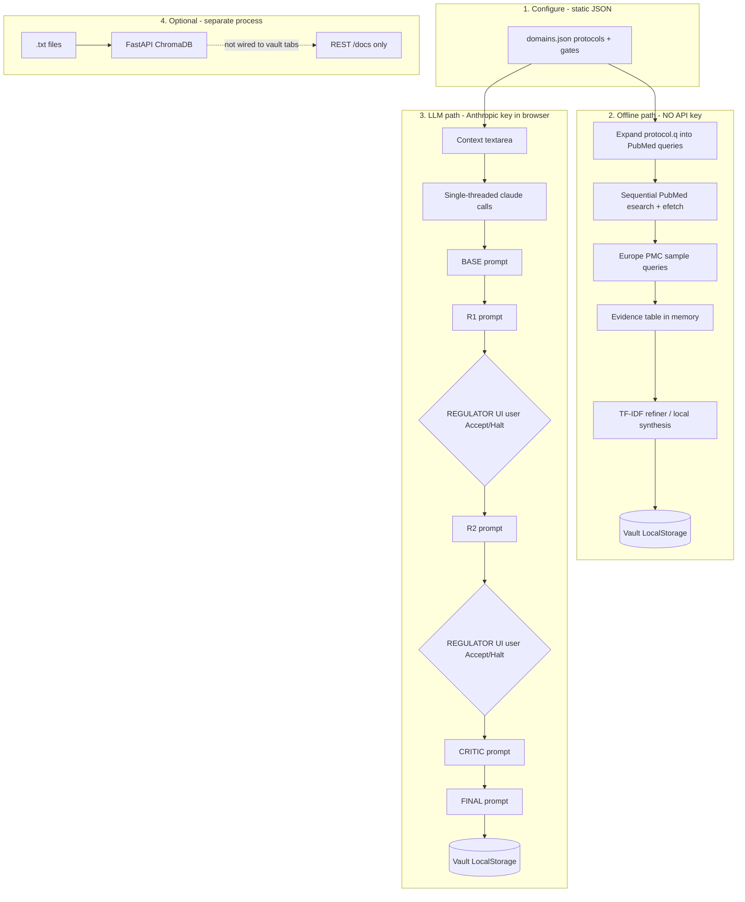

# Generic Research Helper

**One line:** A small, domain-agnostic **browser workflow shell** extracted from the Simplex research UI — PubMed evidence gathering, optional client-side TF-IDF summaries, and a sequential Anthropic prompt chain with manual regulator checkpoints.

> **Honest scope:** This is **not** the full Simplex desktop system (multi-tank corpora, embedded session vaults, or integrated RAG in one loop). It is a **~2,400-line** vanilla JS + optional FastAPI sidecar, suitable as a **template** you reconfigure for any field.

Public repo: [github.com/Dmallick01/generic-research-helper](https://github.com/Dmallick01/generic-research-helper)

## How this relates to Simplex

| | **Simplex System** (parent) | **Simplex Intelligence** (Downloads) | **This repo** |
|---|---------------------------|--------------------------------------|---------------|
| **Size** | Large single-page app + domain corpus | Backend RAG + thin query UI | ~15 JS modules + optional API |
| **Knowledge** | 5–7 protocol “tanks” with bundled research text | ChromaDB over your `.txt` papers | No bundled science — placeholder demos only |
| **Literature** | Tank-specific PubMed query banks (hundreds of hardcoded queries) | Upload / sample papers only | Queries generated from `protocol.q` in JSON |
| **Synthesis** | Full agent DAG + vault exports | Semantic RAG + streaming answers | Browser `fetch` to Anthropic; prompts in `prompts.js` |
| **Regulator** | Same UI pattern | N/A | **Human** pass/halt buttons; gate labels parsed heuristically from model text |
| **Offline** | TF-IDF + evidence matrix | N/A | TF-IDF in `refiner.js` / `synth_local.js` (no embeddings) |
| **RAG** | Optional backend | **Core** of that project | **Separate** `backend/` — not connected to vault tabs |

Use this repo when you want the **Simplex-style tabs and prompt stages** without shipping proprietary research content. Use the included `backend/` when you need **embedding search over a fixed `.txt` corpus** (same idea as the old Simplex Intelligence project — optional and separate from the vault tabs).

## What is actually implemented



**Important details the diagram encodes:**

1. **Two independent paths** — Scraper/refiner does not feed the agent pipeline automatically; you copy context or use Continue tab manually.
2. **“Parallel Search”** is sequential HTTP with rate-limit sleeps (~280–400 ms between calls), not a job queue or worker pool.
3. **REGULATOR** stops for **your** click (Accept/Halt), not an automated DAG executor.
4. **RAG backend** runs via `run.sh`; the vault UI does not call it unless you build that integration.

## Complexity justification (why the repo is small)

| Component | Lines (approx.) | Role |
|-----------|-----------------|------|
| `search_engine.js` | 530 | PubMed + partial Europe PMC, dedupe, evidence table |
| `synth_local.js` | 310 | In-browser TF-IDF clustering |
| `refiner.js` | 290 | Query-anchored TF-IDF report |
| `pipeline.js` | 190 | Ordered `claude()` calls |
| `prompts.js` | 120 | String templates only — no agent framework |
| `regulator.js` | 80 | Modal checkpoint UI |
| `backend/main.py` | 400 | Optional Chroma RAG (from Simplex Intelligence lineage) |

There is no plugin system, no job runner, no database in the vault UI, and no multi-model router in the browser path. That is intentional: the value is **configurable prompts + evidence table + export**, not production MLOps.

## Quick start

### Vault UI (main artifact)

```bash
cd generic-research-helper
open vault-ui/index.html
# or: python3 -m http.server 8765 --directory vault-ui
```

1. Edit `vault-ui/config/domains.json` (or `config/domains.json` — keep in sync).
2. **Scraper** tab → select protocol → **Run Sequential Search** (no key).
3. Optionally run **Statistical Synthesis** or **Refiner** on the evidence table (no key).
4. **Pipeline** tab → paste Anthropic key → **Initialize Protocol** (paid API; runs BASE→FINAL with two regulator stops).

### Optional RAG API (Simplex Intelligence-style)

```bash
cp backend/.env.example backend/.env
chmod +x run.sh && ./run.sh
# http://localhost:8000/docs
```

Ingest `.txt` files via API; query modes (`synthesis`, `gaps`, etc.) are defined in `backend/main.py`. This does **not** replace the Scraper tab.

## Configure your domain

```json
{
  "defaultContext": "Your scope and boundaries…",
  "protocols": {
    "1": {
      "name": "Literature Review",
      "q": "your topic systematic review",
      "desc": "Injected into agent prompts for protocol 1."
    }
  },
  "gates": [
    { "label": "RELEVANCE", "q": "Is evidence on-topic?" }
  ]
}
```

Optional: `queryVariants` array per protocol overrides auto-generated PubMed query suffixes.

## Project structure

```
generic-research-helper/
├── vault-ui/           # Static HTML/CSS/JS (the Simplex-style UI shell)
│   ├── js/prompts.js   # Prompt templates only
│   ├── js/pipeline.js  # Sequential API calls
│   ├── js/search_engine.js
│   └── config/domains.json
├── backend/            # Optional RAG (Chroma + FastAPI) — separate from tabs
├── config/domains.json
├── sample_documents/     # Placeholder .txt for RAG demo — replace
└── docs/ARCHITECTURE.md
```

## Limitations (read before comparing to Simplex)

- Browser calls Anthropic directly (`api.js`) — CORS header required; not a secure production pattern without a proxy.
- No automatic wiring from evidence table → BASE agent (manual copy / Continue tab).
- Regulator gates are **not** enforced by code logic — only suggested in prompts and shown in UI.
- No built-in embeddings in the vault path; TF-IDF is lexical only.
- Sample documents are generic placeholders, not a research program.

## Related repos

- [openclaw-research](https://github.com/Dmallick01/openclaw-research) — multi-DB literature fetch + Ollama DAG on a server (more moving parts than this UI)

## License

MIT
