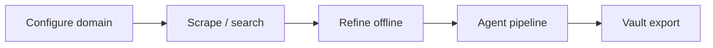

# Generic Research Helper

**One line:** A local-first, domain-agnostic research orchestrator — scrape literature, refine evidence offline, run a six-agent synthesis DAG, and export to a markdown vault.

> This repo ships **framework only**. Replace `config/domains.json` and `sample_documents/` with your own domain. No proprietary research content is included.

## Flow overview



| Stage | What it does | API key? |
|-------|----------------|----------|
| Scraper | PubMed query permutations from your protocol `q` | No |
| Refiner / synthesis | TF-IDF on abstracts | No |
| BASE → FINAL | Six-agent DAG with regulator checkpoints | Anthropic (optional) |
| RAG backend | Semantic search over `.txt` corpus | Anthropic + Chroma |

## Quick start

### Vault UI (recommended first run)

```bash
open vault-ui/index.html
# or: python3 -m http.server 8765 -d vault-ui
```

1. Open **Settings** → paste Anthropic key (only for Pipeline tab).
2. Edit `config/domains.json` for your field.
3. **Scraper** → pick protocol → Run Parallel Search.
4. **Pipeline** → Run Full Sequence (optional).

### Optional RAG API

```bash
cp backend/.env.example backend/.env
chmod +x run.sh && ./run.sh
```

Docs: http://localhost:8000/docs

## Configure your domain

```json
{
  "defaultContext": "Your scope, pillars, and boundaries…",
  "protocols": {
    "1": {
      "name": "Literature Review",
      "q": "your topic systematic review",
      "desc": "What this protocol must produce."
    }
  },
  "gates": [
    { "label": "RELEVANCE", "q": "Is evidence on-topic?" }
  ]
}
```

See [docs/ARCHITECTURE.md](docs/ARCHITECTURE.md) for the full flow map.

## Project structure

```
generic-research-helper/
├── vault-ui/              # Pipeline + scraper + vault (HTML/JS)
├── config/domains.json    # Your protocols (copy to vault-ui/config too)
├── backend/               # Optional FastAPI RAG
├── sample_documents/      # Placeholder corpus — replace before real use
├── docs/ARCHITECTURE.md
└── run.sh
```

## Screenshots

Add captures to `docs/screenshots/` after customizing your domain (Pipeline, Scraper evidence matrix, Vault).

## Tech stack

Python (FastAPI, ChromaDB) · Vanilla JS · LocalStorage · PubMed E-Utilities

## Related work

- **[openclaw-research](https://github.com/YOUR_USER/openclaw-research)** — same tournament DAG on Apple Silicon via Ollama

## License

MIT
