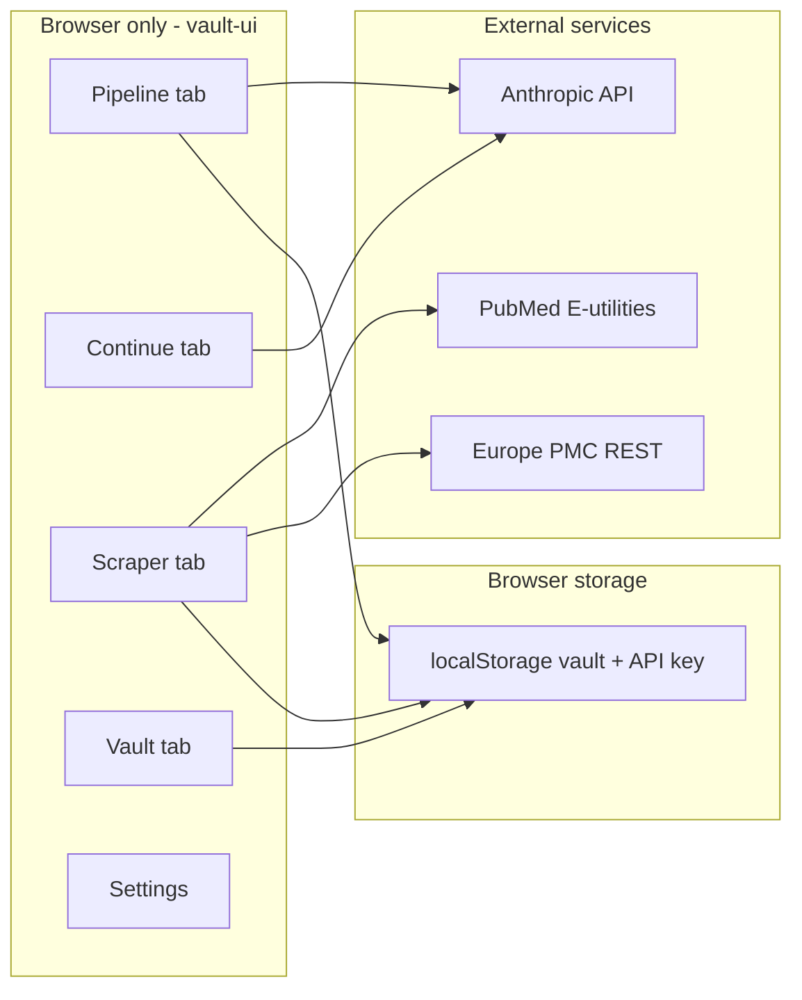

# Architecture — Generic Research Helper

This document matches **what is in the repository**, not the full historical Simplex desktop system.

## Lineage

```
Simplex System (large HTML app, domain-specific tanks + sample vault)
        │
        ├──► Simplex Intelligence (RAG-first: Chroma + query UI)
        │
        └──► generic-research-helper (this repo)
                 • Stripped domain content
                 • Kept: tabbed vault UI + prompt chain + PubMed scraper
                 • Optional: backend/main.py RAG copy
```

## Runtime map (accurate)



There is **no** application server required for the vault UI. Files are opened as static HTML or served by any static file server.

## Module responsibilities

| File | Responsibility | Complexity |
|------|----------------|------------|
| `tanks.js` | Load `domains.json`, render protocol pills | Low |
| `search_engine.js` | Build queries from `protocol.q`, sequential fetch, evidence table | **Highest** |
| `refiner.js` | TF-IDF over abstracts already in memory | Medium |
| `synth_local.js` | Theme buckets via keyword clusters + TF-IDF | Medium |
| `pipeline.js` | `await claude()` chain, vault push on success | Low–medium |
| `regulator.js` | Promise + DOM modal; user resolves pass/halt | Low |
| `prompts.js` | Template strings | Low |
| `api.js` | Single-model Anthropic HTTP client | Low |
| `vault.js` | localStorage array of markdown exports | Low |
| `scraper.js` | Optional Claude synthesis over evidence (extra API call) | Low |
| `backend/main.py` | Chroma ingest + query endpoints | Medium (optional) |

## Agent pipeline (actual control flow)

Not a DAG executor. Pseudocode equivalent of `pipeline.js`:

```
for stage in [BASE, R1]:
    output[stage] = claude(PROMPTS[stage](context, protocol))
    if stage == R1:
        showCheckpoint()  // blocks until user clicks Accept or Halt
        if Halt: throw
output[R2] = claude(...)
showCheckpoint()
output[CRITIC] = claude(...)
output[FINAL] = claude(...)
vault.push(concat(outputs))
```

Differences from **openclaw-research**:

| Feature | This vault UI | openclaw-research |
|---------|---------------|-------------------|
| Models | Anthropic in browser | Ollama via Next.js API |
| Evidence | PubMed (+ Europe PMC partial) | PubMed + Semantic Scholar + Europe PMC |
| Regulator | Manual UI | Folded into CRITIC stage (automated stream) |
| Persistence | localStorage | Server filesystem cache |

## Offline evidence path

1. `buildProtocolQueries(protocolId)` — suffix expansion on `protocol.q` (see `search_engine.js`).
2. Sequential `esearch` → accumulate PMIDs → batched `esummary` / `efetch`.
3. `lastSearchResults` global in browser memory (lost on refresh unless exported).
4. Refiner / local synthesis read `lastSearchResults` only.

No vector index. No citation graph. Keyword relevance uses protocol word lists from JSON, not ML classifiers.

## Optional RAG path

`backend/main.py`:

- Ingest `.txt` with section-aware chunking (generic headers after de-Simplex refactor).
- ChromaDB persistent store.
- Query modes via request body.

**Integration gap:** Vault tabs do not call `localhost:8000`. Running RAG is a separate workflow (API client, curl, or custom UI).

## Configuration contract

`config/domains.json`:

| Field | Used by |
|-------|---------|
| `defaultContext` | Pre-fills pipeline textarea |
| `protocols[n].name` | UI labels |
| `protocols[n].q` | PubMed query generation |
| `protocols[n].desc` | Agent prompts |
| `protocols[n].queryVariants` | Optional explicit query list |
| `gates[]` | Regulator prompt text + UI gate rows |

## When to extend vs replace

| Goal | Recommendation |
|------|----------------|
| Rebrand for a new field | Edit `domains.json` + prompts only |
| Real embedding search in UI | Wire vault to `backend/` or use OpenCLAW |
| Production agent DAG | Replace `pipeline.js` with server orchestration |
| Simplex-scale query banks | Add `queryVariants` per protocol or external JSON |

## Extension: OpenCLAW

[openclaw-research](https://github.com/Dmallick01/openclaw-research) can consume vault markdown exports as handoff context; it is not a drop-in replacement for this static UI.
