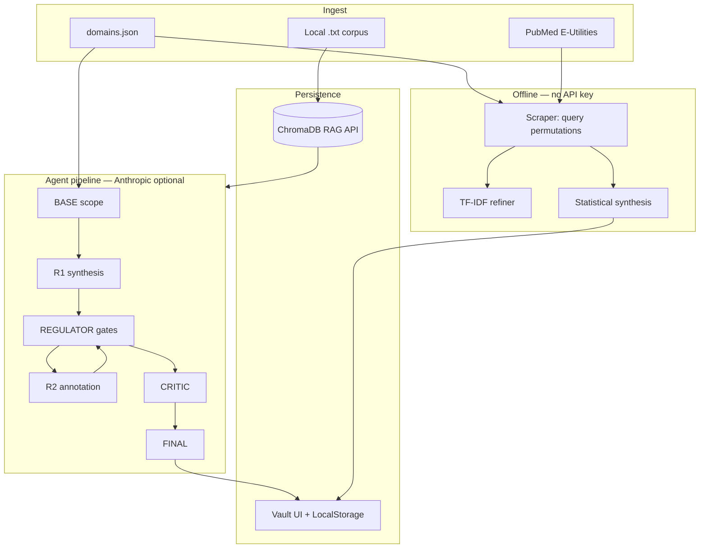

# Architecture — Generic Research Helper

Framework-only repository: no bundled research hypotheses. Configure your domain in `config/domains.json`.

## System flow

## Modules

| Module | Path | Role |
|--------|------|------|
| Vault UI | `vault-ui/` | Tabs: Pipeline, Continue, Scraper, Vault, Settings |
| Domain config | `config/domains.json` | Protocols, regulator gates, default context |
| Scraper engine | `vault-ui/js/search_engine.js` | Builds queries from protocol `q` + suffixes |
| Refiner | `vault-ui/js/refiner.js`, `synth_local.js` | TF-IDF clustering on abstracts |
| Agent prompts | `vault-ui/js/prompts.js` | BASE → FINAL prompt templates |
| RAG API | `backend/main.py` | Optional ChromaDB + Claude over uploaded docs |

## Protocol configuration

Each protocol entry supports:

- `name` — UI label
- `q` — base PubMed search string
- `desc` — injected into agent context
- `queryVariants` (optional) — explicit list of search queries (overrides auto suffix expansion)

## Extension: OpenCLAW Research

[openclaw-research](https://github.com/YOUR_USER/openclaw-research) runs the same DAG against **local Ollama** models and can consume vault exports from this framework.
